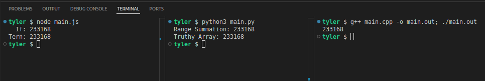

# Question 1

If we list all the natural numbers below 10 that are multiple of 3 or 5, we get 3,5,6,9. The sum of these multiples is 23.

Find the sum of all the multiples of 3 or 5 below 1000.

# Setup

Because the starting questions are simple, my goal is to create solutions in C++, Javascript, and Python _before_ I check whether or not the solution is valid. My secondary goals is for each of them to feature a different _way_ to solve the problem, at least where possible.

# Pre-Verification Thoughts

## Javascript

Just like the classic FizzBuzz problem, the solution to it is very simple. I would personally use this mostly as a way to make sure I like the setup of what I'm doing, the code compiles, etc. etc.

I use Node to run the main.js file, because its fast an easy.

## Python

No real change in the concept behind the solution. Just keep count and sum the values. The method of counting changes slightly, as both methods instead use arrays to store the values, then sum them. This does mean that proposterously large numbers (or a sufficiently crappy machine) would encounter problems with storing all the numbers, but we'll ignore that for this problem. Though this concept will be kept in mind for the future.

## C++

I ended up taking a dinner break before getting to this one. So I apologize to future me and readers for the oddly long time between commits for the three languages.

I specifically wanted a solution that would use recursion, mainly as practice for being comfortable with recursion. Which works out with this problem due to it being a particularly easy use-case for it.

# Large Value Testing

On my initial run of them at the same time, with a large N value, they spit out different values... cool! (Not good)

I figured out fairly quickly that for the Python Range and the C++ implementations, I was duplicating values into the sum. More specifically, numbers that had both 3 and 5 as a common factor. A dumb mistake, but an easy one to spot and fix.

The Python implementation was an easy fix by converting the two series of values into a set, then joining them. The C++ implementation needed to change the function call to include a list of factors to check.

